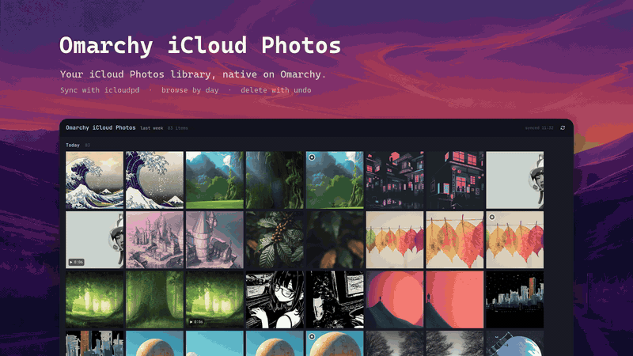
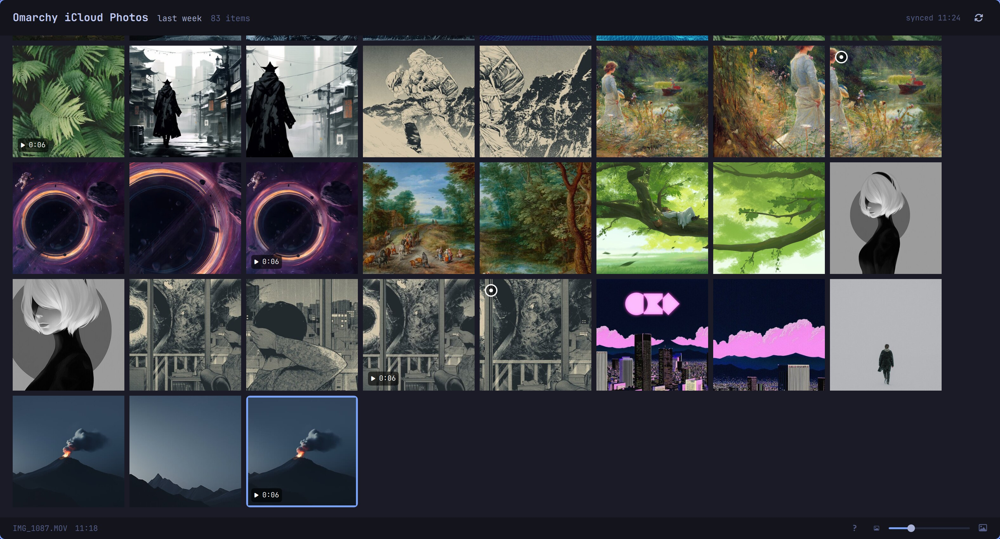

<p align="center">
  
</p>

<h1 align="center">Omarchy iCloud Photos</h1>

<p align="center">Your iCloud Photos library as a native window on <a href="https://omarchy.org">Omarchy</a>.<br>Browse by day, watch your videos, delete with undo, copy and save. No browser tab, no Apple hardware.</p>

<p align="center">
  <a href="LICENSE"></a>
  
  
  
</p>

<p align="center">
  
</p>

<p align="center"><sub>The clip and the screenshots come from the built-in demo mode, so those are Omarchy wallpapers, not anyone's holiday. <a href="assets/social.mp4">MP4 version</a>.</sub></p>

> **Credit where it is due.** The syncing is done by [icloudpd](https://github.com/icloud-photos-downloader/icloud_photos_downloader), the iCloud Photos Downloader by the icloud-photos-downloader project. I did not write it and this repository does not fork it. What you find here is the window, the index, the sign-in and delete helper on top of its pyicloud module, and the glue between them.

## Install

The quickest way is to let your coding agent do it. Paste this into Claude Code, Codex or whatever runs your terminal:

> Install Omarchy iCloud Photos from https://github.com/jankeesvw/omarchy-icloud-photos on this Omarchy machine. Install the pacman packages quickshell, imagemagick, ffmpeg, jq and wl-clipboard if they are missing. Clone the repository into ~/Documents/github.com/jankeesvw/omarchy-icloud-photos and run its install.sh; it needs no root and fetches icloudpd and a Python 3.13 itself. Then start `omarchy-icloud-photos` and tell me it is ready for me to sign in; the sign-in happens inside the window and you never need my password. Do not run icloudpd with `--auto-delete` or `--keep-omarchy-icloud-photos-days`, and do not change the config beyond what install.sh writes.

<details>
<summary>By hand</summary>

```bash
sudo pacman -S --needed quickshell imagemagick ffmpeg jq wl-clipboard
git clone https://github.com/jankeesvw/omarchy-icloud-photos.git ~/Documents/github.com/jankeesvw/omarchy-icloud-photos
~/Documents/github.com/jankeesvw/omarchy-icloud-photos/install.sh
```

The installer links the launcher and the sync script into `~/.local/bin`, adds "Omarchy iCloud Photos" to the app launcher, fetches the icloudpd binary into `~/.local/bin` when it is not installed already, creates a small Python virtualenv for the iCloud helper (a 3.13 from mise when the system Python is newer) and enables the sync timer. Nothing after the pacman line needs root.

Then start `omarchy-icloud-photos`, or pick "Omarchy iCloud Photos" in the launcher, and sign in. The first sync takes a few minutes; HDR videos take the longest because each one gets a tone-mapped copy for playback. Run `install.sh` again after a `git pull`; everything is linked, not copied.

</details>

## Why

Apple does not make an iCloud Photos client for Linux, and the web app is a browser tab that forgets who you are every few days. This is the other way round: a small sync script keeps a local copy of your most recent photos and videos, and a Quickshell window shows them the way the Photos app does, newest at the bottom, in whatever Omarchy theme you are running. Everything is a keystroke away and nothing needs a mouse.



## What it does

- **Grid by day.** Photos, videos and Live Photos from the last week, month or whatever range you pick, grouped by day with the newest at the bottom. Thumbnails scale with a slider.
- **Viewer.** Full-window stills, video with a timeline you can scrub, Live Photos that play on Space. iPhone videos are HDR and most Linux players show them washed out; here they look right.
- **Delete with undo.** `d` moves an item, or a selection, to iCloud's Recently Deleted, the same 30-day bin the Photos app uses. Undo brings it back, from the toast or with `u`. Nothing here can empty that bin.
- **Copy and save.** `y` puts the image on the clipboard, or a file list when several are selected. `s` and the Download button save a copy to `~/Downloads` as JPEG or MP4, whatever the original was. Clicking the filename copies its full path.
- **Signs in by itself.** Apple ID, password and the two-factor code go into the window on first run and whenever the session expires. The password is only used to open the session and is never stored.
- **Wallpaper.** `W` makes the current photo the Omarchy background, HEIC included.
- **Stays in sync.** A systemd user timer pulls new items every 30 minutes. An open window picks them up on its own.
- **Follows your theme.** Colours come live from Omarchy's `colors.toml`; switch themes and the window switches with you.

## Built on

The window is the only new thing here; the plumbing is existing, well-worn tools by other people.

- **[icloudpd](https://github.com/icloud-photos-downloader/icloud_photos_downloader)** does the downloading. It speaks the same private web API as icloud.com, keeps a session in `~/.config/icloudpd` and is used strictly in copy mode.
- **pyicloud**, the module that ships inside icloudpd, handles sign-in with two-factor and the per-asset delete and restore, from a small Python helper in the repository's own virtualenv.
- **bash and jq** build the index: one JSON file listing every item in the range with its thumbnail, preview, video and capture time.
- **ImageMagick** with libheif makes the thumbnails and the JPEG previews of HEIC originals, which Qt cannot decode.
- **ffmpeg** grabs video poster frames and tone-maps HDR videos (HLG and PQ) to SDR H.264 copies for playback, since Qt's player does no tone mapping.
- **[Quickshell](https://quickshell.org)** on Qt 6 renders the window in QML, with QtMultimedia for video.
- **systemd** user units run the sync every 30 minutes at low priority.

## Safety first

The sync can only download. icloudpd runs in its default copy mode, without `--auto-delete` or `--keep-omarchy-icloud-photos-days`, and the local library is never pruned: shrink the range and files simply leave the grid. The one thing that writes to iCloud is `d`, which flips a single asset's `isDeleted` flag, exactly what the Photos app does when you tap the bin. There is no bulk delete and no way to empty Recently Deleted from here.

It talks to iCloud through the same unofficial web API icloudpd uses. Apple can change that at any time, and Apple rate-limits sign-ins: a few attempts in a row get you a "temporarily refusing" answer that clears by itself after a while. When something breaks, the window says so.

## Keys

Press `?` in the app for this list.

| Key | Grid | Viewer |
|---|---|---|
| `h` `j` `k` `l`, arrows | move | previous / next |
| `Shift` + move, shift-click | select a range | |
| `Ctrl` + click, `x`, `Ctrl` + `Space` | add or remove one | |
| `Ctrl` + `a` | select all | |
| `Enter`, `Space` | open the viewer | pause or resume, toggle a Live Photo |
| `←` / `→` | move | seek 5 seconds |
| `d` / `u` | delete, undo | same |
| `y` / `Y` | copy image or files, copy path | same |
| `s` | save to `~/Downloads` as JPEG or MP4 | same |
| `o` | open in the default app | same |
| `W` | set as the Omarchy wallpaper | same |
| `r` | sync now | |
| `-` / `+` | smaller, larger thumbnails | |
| `g` / `G` | oldest, newest | |
| `?` | show the keys | same |
| `Esc`, `q` | clear the selection, quit | back to the grid |

A click selects, a second click on the selected item opens it. Hovering does nothing.

## Configuration

`~/.config/omarchy-icloud-photos/config` is sourced by the sync script.

| Variable | Default | Meaning |
|---|---|---|
| `APPLE_ID` | set by the sign-in card | The account to sync |
| `LIBRARY` | `~/Pictures/iCloud` | Where originals land, as `YYYY/MM/` folders |
| `DAYS` | `7` | How far back the grid goes. The header says "last week", "last month" and so on |
| `RECENT_LIMIT` | `500` | Newest assets icloudpd walks per run. Raise it with `DAYS`; 2000 covers a month comfortably |
| `COOKIES` | `~/.config/icloudpd` | Where the iCloud session lives |
| `CACHE` | `~/.cache/omarchy-icloud-photos` | Thumbnails, previews, SDR video copies and the index |
| `LAUNCHER_NAME` | `Omarchy iCloud Photos` | What the app is called in the launcher; re-run `install.sh` after changing it |

Changing `DAYS` never deletes anything: a smaller range only trims the cache, a larger one downloads what is missing on the next sync. "Everything" is not an option yet; the grid is not built for tens of thousands of items.

The same session also works from the command line, for a headless box or when you prefer a terminal:

```bash
icloudpd --auth-only --username you@example.com --cookie-directory ~/.config/icloudpd
```

## Demo mode

`omarchy-icloud-photos --demo` starts the window on a stand-in library built from the Omarchy theme backgrounds: photos, portrait crops, a few slow-pan videos and Live Photo pairs, spread over the last week. It lives under `~/.cache/omarchy-icloud-photos-demo`, apart from your real config and cache, and nothing in it talks to iCloud, so delete and undo can be tried freely. That is what the screenshots are made with. `omarchy-icloud-photos-demo --reset` rebuilds it, and `omarchy-icloud-photos --demo --tour` scrolls through the grid by itself and opens a photo, for recording a clip.

## How it works

`bin/omarchy-icloud-photos-sync` runs icloudpd for the newest items, then indexes every file in the library newer than `DAYS`. Capture time is the file's mtime, which icloudpd sets to the asset's creation date. Each item gets a 400 px thumbnail; HEIC also gets a 2200 px JPEG preview because Qt cannot decode HEIC. A Live Photo's `_HEVC.MOV` companion folds into its still. HDR videos get a tone-mapped H.264 copy for playback; the original stays untouched and is what `o`, `s` and `Y` refer to. The result is `index.json` and `status.json` in the cache; the window watches both.

`bin/icloud_helper.py` is the only code that talks to iCloud beyond downloading: it signs in, and it moves one asset at a time to Recently Deleted or back. It runs on the pyicloud module that ships with icloudpd, in the repository's own virtualenv.

```
bin/omarchy-icloud-photos          launcher: quickshell -p ui/shell.qml (--demo, --tour)
bin/omarchy-icloud-photos-sync     download + index, safe to run any time
bin/omarchy-icloud-photos-demo     builds the demo library from the theme backgrounds
bin/omarchy-icloud-photos-helper   wrapper that runs icloud_helper.py in .venv
bin/icloud_helper.py       login, and find / delete / restore one asset
ui/shell.qml               window, grid, key handling
ui/Thumb.qml               one grid cell
ui/Viewer.qml              full-window still / video with timeline
ui/ConfirmDelete.qml       the "move to Recently Deleted?" dialog
ui/Login.qml               sign-in card (Apple ID, password, 2FA code)
ui/Help.qml                the ? overlay
ui/Theme.qml               colours from ~/.local/state/omarchy/current/theme/colors.toml
systemd/                   user service + 30 minute timer
install.sh                 links everything into place
```

## Contributing

Issues and pull requests are welcome. Run `omarchy-icloud-photos --demo` to work on the window without an Apple account; the demo library exercises photos, videos and Live Photos. Keep the safety rules: the sync stays in copy mode, and nothing deletes more than the one item the user pointed at.

## License

MIT. icloudpd, Quickshell and the other tools have their own licenses.
